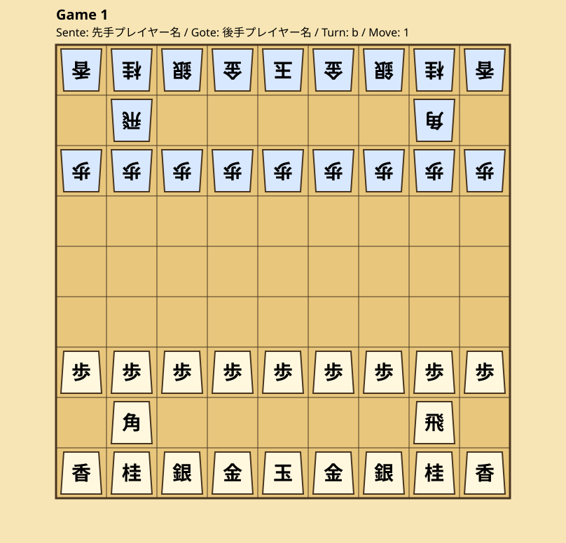

# git-shogi

## 対局データ

対局の盤面情報は `data/games.json` に保存します。

```json
[
  {
    "gameId": 1,
    "sentePlayer": "先手プレイヤー名",
    "gotePlayer": "後手プレイヤー名",
    "sfen": "lnsgkgsnl/1r5b1/ppppppppp/9/9/9/PPPPPPPPP/1B5R1/LNSGKGSNL b - 1"
  }
]
```

各項目の意味は次のとおりです。

- `gameId`: 対局を識別する ID
- `sentePlayer`: 先手プレイヤー名
- `gotePlayer`: 後手プレイヤー名
- `sfen`: 対局開始時点の盤面を表す SFEN 文字列

## SFEN

SFEN は、将棋の盤面を文字列で表す形式です。上の例は初期局面を表しています。

SFEN は空白区切りで、次の情報を順番に持ちます。

1. 盤面
2. 手番（`b` は先手、`w` は後手）
3. 持ち駒（`-` は持ち駒なし）
4. 手数

盤面では、大文字が先手、小文字が後手を表します。駒の記号は以下のとおりです。

| SFEN | 駒 |
| --- | --- |
| `K` / `k` | 玉 |
| `R` / `r` | 飛 |
| `B` / `b` | 角 |
| `G` / `g` | 金 |
| `S` / `s` | 銀 |
| `N` / `n` | 桂 |
| `L` / `l` | 香 |
| `P` / `p` | 歩 |

成り駒は、駒の前に `+` を付けて表します。たとえば、`+R` は龍、`+B` は馬です。

## 盤面 SVG

`scripts/render_shogi_board.py` は、`data/games.json` の先頭の対局を読み込み、SFEN の盤面を SVG に変換します。盤上の駒だけでなく、SFEN の持ち駒も先手・後手ごとに表示します。成り駒は `+R` を「龍」、`+B` を「馬」、`+P` を「と」のように日本語で表示します。

Pull Request が作成・更新されると、GitHub Actions が変更前後の盤面を次のファイルへ出力します。

- `public/render-shogi-board-before.svg`: 変更前の盤面
- `public/render-shogi-board.svg`: 変更後の盤面

同じリポジトリ内の Pull Request では、生成された2つの SVG が Pull Request のコメントに Markdown 形式で表示されます。比較元の局面がない新規対局の場合は、Before は表示されません。

README からは現在の盤面を確認できます。



## 指し手の入力

SFEN を直接編集する代わりに、`scripts/apply_shogi_move.py` で移動元と移動先を指定できます。座標は、将棋の棋譜と同じく `筋` と `段` をつなげた形式です（例: `7g`）。

通常の移動:

```shell
python scripts/apply_shogi_move.py --game-id 1 --from 7g --to 7f
```

成る場合は `--promote` を付けます。

```shell
python scripts/apply_shogi_move.py --game-id 1 --from 2b --to 2a --promote
```

持ち駒を打つ場合は、移動元の代わりに `--drop` を指定します。

```shell
python scripts/apply_shogi_move.py --game-id 1 --drop P --to 5e
```

指定した手が将棋のルールに反する場合、JSON は更新されずエラーになります。

## ルール検証

`scripts/shogi_rules.py` は、次の基本ルールを検証します。

- 駒の移動方向、盤外への移動、駒の飛び越し
- 成りと強制成り
- 持ち駒の取得と駒打ち
- 二歩、行き所のない駒の駒打ち
- 王手、自玉を王手にする手、詰み
- 打ち歩詰め
- SFEN の形式、手番、手数

Pull Request では `scripts/validate_game_transition.py` が変更前後の `data/games.json` を比較し、現在の局面が直前の局面から合法な1手で変化しているかを検証します。SFEN の形式、手番、手数、対局データの必須項目も確認します。

GitHub Actions の `test.yml` は、Black によるフォーマット、flake8 による静的解析、pytest によるテストを実行します。

開発用のチェックは次のコマンドで実行できます。

```shell
python -m black --check scripts tests
python -m flake8 scripts tests
python -m pytest
```
